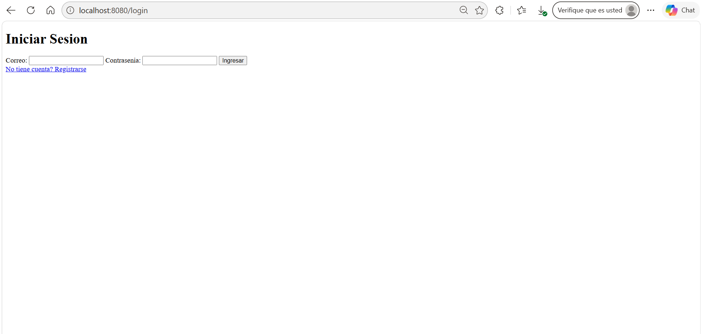
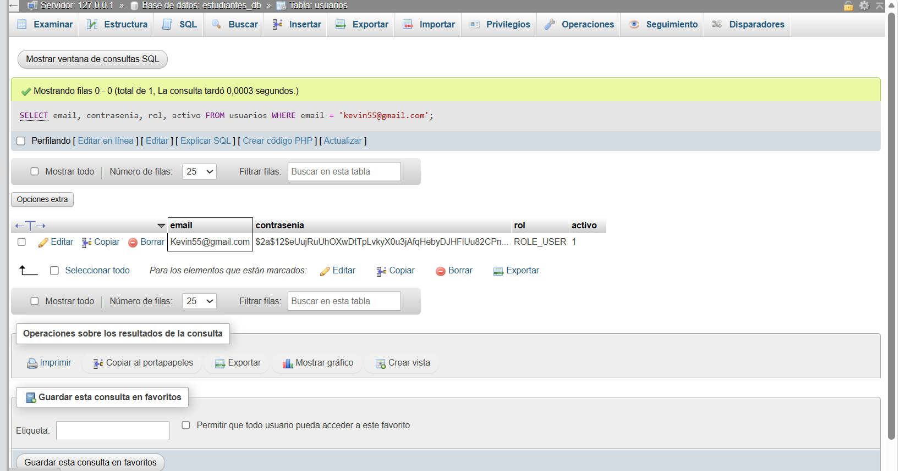
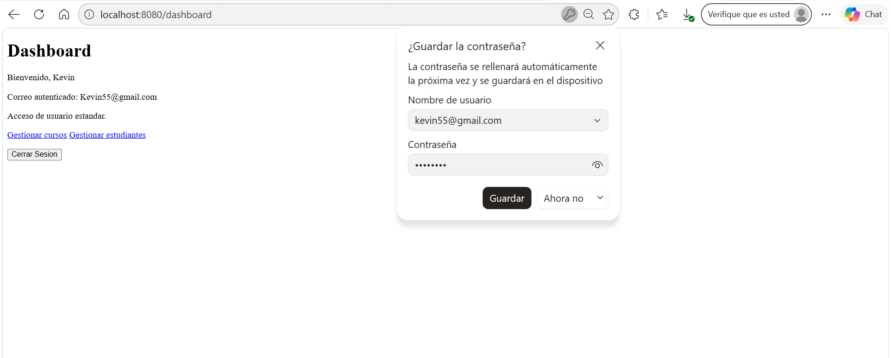
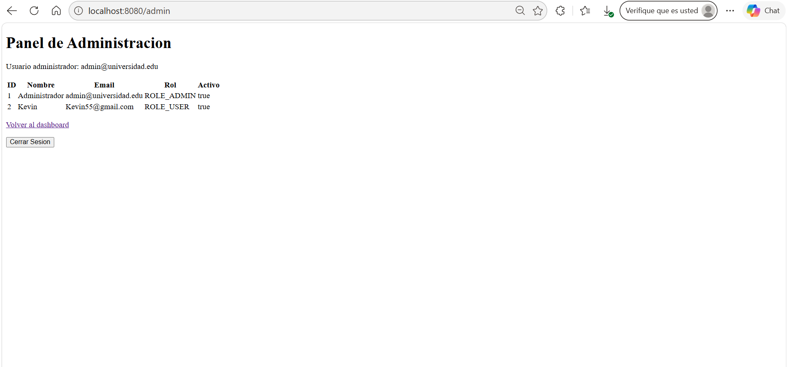

# Sistema de Autenticación con Spring Security 6

## Autor

- **Nombre:** Kevin Ramirez  
- **Código:** 02220131008  
- **Programa:** Ingeniería de Sistemas  
- **Unidad:** 9 Seguridad en Aplicaciones web  
- **Actividad:** Post-Contenido 1 
- **Fecha:** 04/05/2026 

---

## Descripción del Proyecto

Este proyecto implementa un sistema completo de autenticación y autorización utilizando **Spring Boot + Spring Security 6**, conectado a **MySQL**.

Incluye:

- Registro de usuarios con contraseñas encriptadas (BCrypt)
- Login personalizado con formulario
- Autenticación basada en base de datos
- Autorización por roles:
  - `ADMIN`
  - `USER`
- Protección de rutas
- Panel de administración restringido

---

## Objetivo

Implementar un sistema seguro que:

- Almacene contraseñas de forma segura (hash BCrypt)
- Permita autenticación desde base de datos
- Controle el acceso según roles
- Proteja rutas con Spring Security

---

## Tecnologias

- Java 17
- Spring Boot 3.2.5
- Spring Security 6
- Spring Data JPA
- Thymeleaf + thymeleaf-extras-springsecurity6
- MySQL

## Configuracion de MySQL

Crear la base de datos y el usuario usado por `application.properties`:

```sql
CREATE DATABASE IF NOT EXISTS estudiantes_db;
CREATE USER IF NOT EXISTS 'appuser'@'localhost' IDENTIFIED BY 'apppass';
GRANT ALL PRIVILEGES ON estudiantes_db.* TO 'appuser'@'localhost';
FLUSH PRIVILEGES;
```

La aplicacion usa:

```properties
spring.datasource.url=jdbc:mysql://localhost:3306/estudiantes_db?useSSL=false&serverTimezone=UTC
spring.datasource.username=appuser
spring.datasource.password=apppass
spring.jpa.hibernate.ddl-auto=update
```

## Ejecucion

```bash
./mvnw spring-boot:run
```

En Windows:

```bash
mvnw.cmd spring-boot:run
```

Abrir:

- `http://localhost:8080/login`
- `http://localhost:8080/registro`
- `http://localhost:8080/dashboard`
- `http://localhost:8080/admin`

La conexion de MySQL esta configurada en el puerto `3306`, que es el puerto
normal de MySQL en XAMPP.

## Usuarios de prueba

Usuario normal:

- Email: se crea desde `/registro`
- Contrasenia: la que se indique en el formulario
- Rol asignado automaticamente: `ROLE_USER`

Usuario administrador:

- Email: `admin@universidad.edu`
- Contrasenia de prueba: `admin123`
- Rol: `ROLE_ADMIN`

Despues de arrancar la aplicacion una vez para que Hibernate cree la tabla
`usuarios`, insertar el administrador en MySQL:

```sql
INSERT INTO usuarios (nombre, email, contrasenia, rol, activo)
VALUES (
  'Administrador',
  'admin@universidad.edu',
  '$2a$12$6BG2hGeJVuWUvNmqGcyTH.g8bJ6niKwEASCyFgKQyCW5RSe1VjxTS',
  'ROLE_ADMIN',
  1
);
```

El hash anterior fue generado con BCrypt costo 12 para la contrasenia de prueba
`admin123`.

## Funcionalidad implementada

- `SecurityConfig` usa `SecurityFilterChain`, login personalizado y logout con
  invalidacion de sesion.
- `UsuarioDetailsService` carga usuarios desde MySQL por correo electronico.
- `UsuarioService.registrar` valida correos duplicados y guarda la contrasenia
  con `BCryptPasswordEncoder(12)`.
- `/login`, `/registro`, `/css/**` y `/js/**` son publicas.
- `/admin` y `/admin/**` requieren rol `ADMIN`.
- El resto de rutas requiere autenticacion.
- El dashboard muestra el nombre del usuario autenticado y opciones visibles por
  rol con Thymeleaf Security.

---

## Capturas del Proyecto

Las capturas se encuentran en la carpeta `evidencias/`.

### Correr aplicación 



### Contraseña hasheada con BCrypt



### Dashboard de usuario




### Error 403 Forbidden


### Panel de Administración



